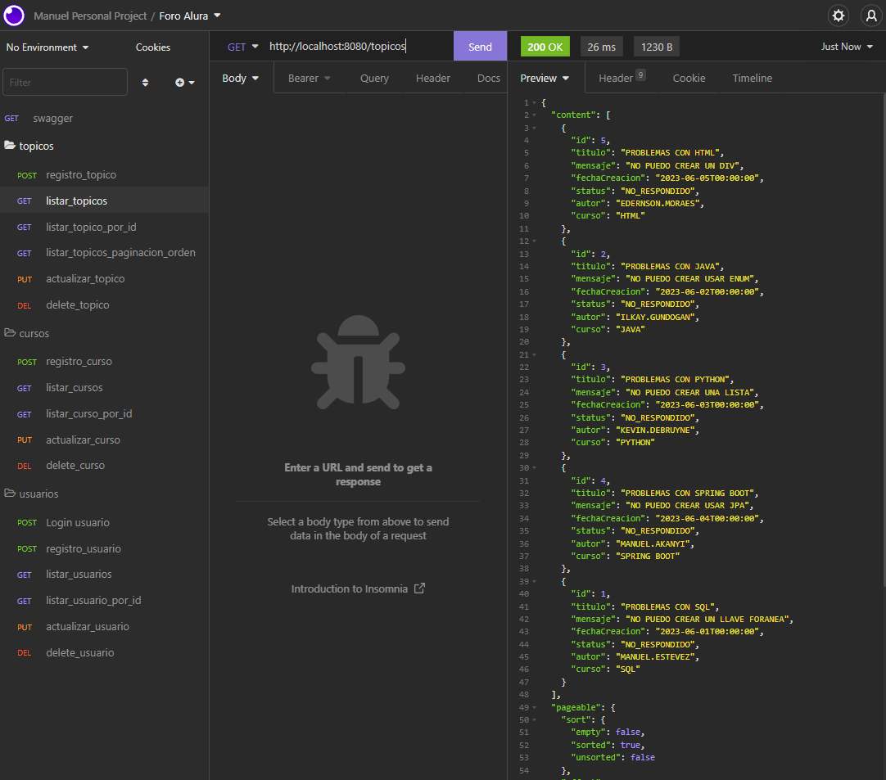
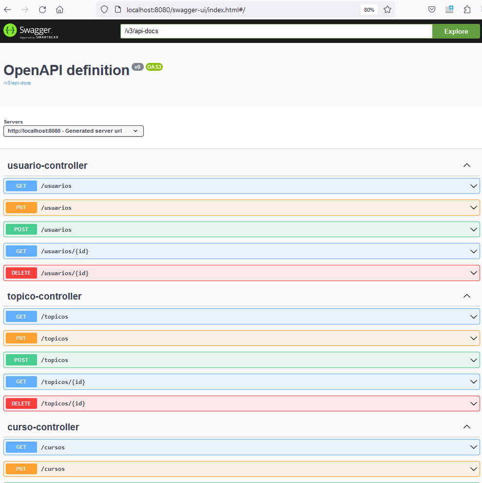

# Challenge ONE | Back End | Foro Alura 

     

Repositorio de la resolución del desafío del Challenge Back End de una API REST usando Java y Spring para el Foro Alura,
impartido por el Programa Oracle One en coordinación con Alura Latinoamérica.

✔️ **Historia**

¡Desafío del Challenge Back End!

El foro alura es un lugar donde todos los alumnos de la plataforma alura pueden colocar sus preguntas sobre determinados cursos,
este mágico lugar está lleno de mucho aprendizaje y de colaboración entre alumnos, profesores y moderadores.

Ya sabemos para que sirve el foro y sabemos cómo se ve, pero ¿sabemos cómo funciona por detrás? Es decir ¿dónde se almacenan las informaciones? ¿cómo se tratan esos datos para que se relacione un tópico con una respuesta, o como se relacionan los usuarios con las respuestas de un tópico?

✔️ **Objetivo**

Alura solicita replicar a nivel de back end el proceso para manejar las interacciones de los alumnos con el foro, y para lo cual se creó una API REST usando Spring.

✔️ **Requisitos**

Nuestra API se centra específicamente en los tópicos, y debe permitir a los usuarios:

- Crear un nuevo tópico
- Mostrar todos los tópicos creados
- Mostrar un tópico específico
- Actualizar un tópico
- Eliminar un tópico

Lo anterior conocido comúnmente como CRUD (CREATE, READ, UPDATE, DELETE) para lo cual se utilizará un framework Spring Boot y un modelo de arquitectura de software conocido como REST.

✔️ **Resultado**

Creación de la API REST con las siguientes funcionalidades

- API con rutas implementadas siguiendo las mejores prácticas del modelo REST
- Validaciones realizadas según reglas de negócio
- Implementación de una base de datos para la persistencia de la información

- ### Tecnologías utilizadas:

  - [Intellij](https://www.jetbrains.com/)
  - [MySql](https://www.mysql.com/)
  - [Java](https://www.java.com/en/)
  - [Spring Security](https://start.spring.io/)
  - [Token JWT](https://jwt.io/)

✔️ **Testeo de los request**

Para testear los diferentes request permitidos de la api rest se utilizó la herramienta Insomnia

✔️ **Documentación en Swagger**

Para documentar las peticiones permitidas se utilizó Swagger

http://localhost:8080/swagger-ui/index.html

## Autor

[Manuel Estevez (manueletz)](https://github.com/manueletz)

💙 Alura Latam

🧡 Oracle

